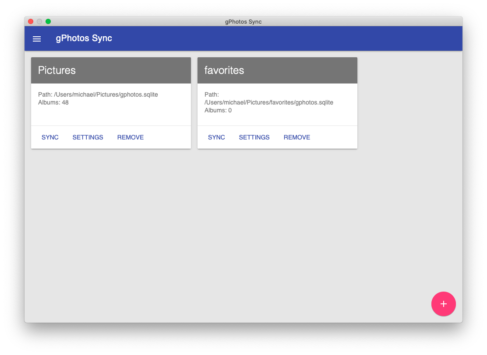
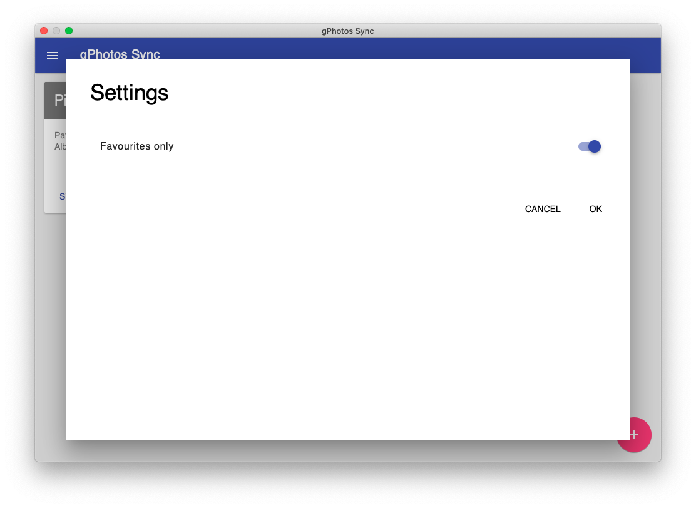
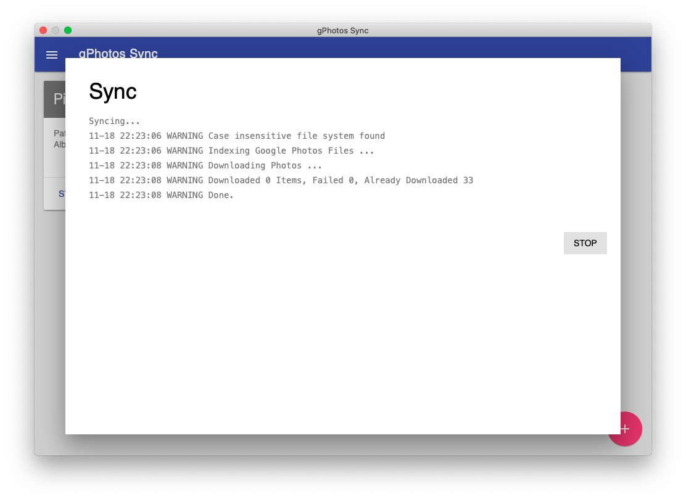

# gphotos-sync-ui

Graphical User Interface for the great gphotos-sync tool using node and DeskGap

*Under developement - Not working yet*

## Download

The app is not yet available for download

## Testing

### macOS

* Download or clone the project
* Run `make.command` script (make executable if necessary using `chmod +x make.command`)
* The app is copied to `~/Applications` folder
* Dependencies: none

### Linux

*Not available yet*

### Windows

*Not available yet*

## Project status

Done

* add existing library
* sync with default settings
* sync favorites only

Todo

* create new library
* implement all gphotos-sync settings
* ui for credentials

