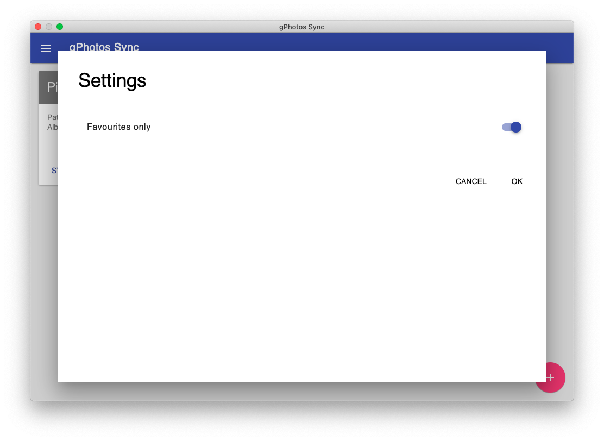

# gphotos-sync-ui

Graphical User Interface for the great gphotos-sync tool using node and DeskGap

*Under developement - Not working yet*

Done

* add existing library
* sync with default settings
* sync favorites only

Todo

* create new library
* implement all gphotos-sync settings
* ui for credentials

